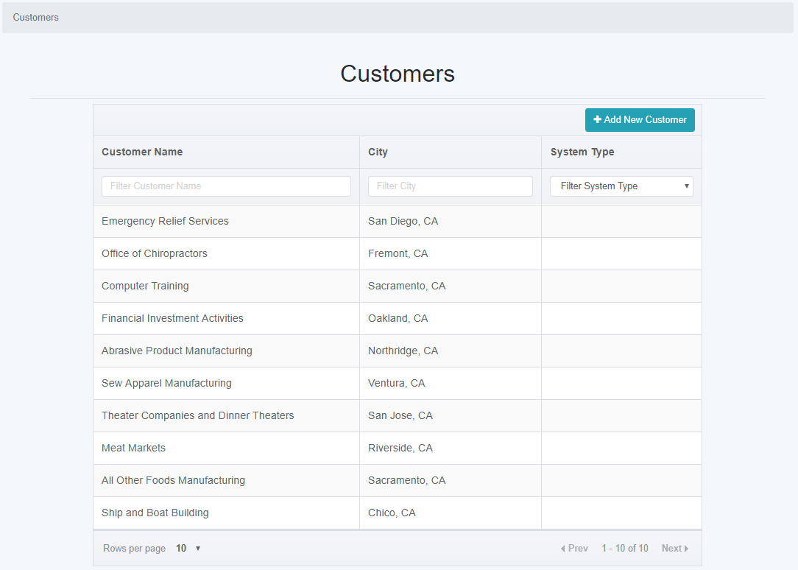
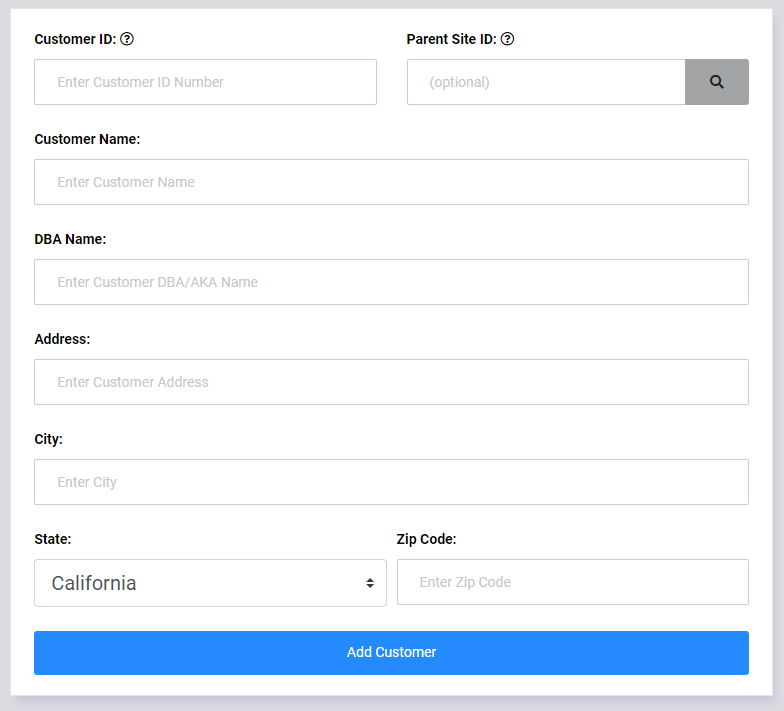

Customer Information
====================

Customer Information allows users to share information about all of your customers in a single location.  This includes information such as:

    * Equipment Installed Onsite
    * Information about the equipment (i.e. login passwords, and other access information)
    * Special Notes about the cutomer or their equipment
    * Files such as backups of the customer equipment, or maps and other customer specific files.
    
Search Customer Page
--------------------

    
The Customer Search page allows you to select a customer to view.  The list can be filtered by the Customer Name, their City, or the type of equipment installed.

To create a new customer, click the "Add New Customer" link in the top right of the customer list.

New Customer Page
-----------------

    
To create a new customer, the following information should be entered in the New Customer form.

    * Customer ID - this is an unique numerical identifier for the customer.  If your company uses a separate billing software with a customer database, the Customer ID should match the billing database.
    * Customer Name
    * DBA Name - If the customer has an alternate name, it can be entered here.
    * Address
    * City
    * State
    * Zip Code

When the customer form is submitted, you will be re-directed to the Customer Details page which will allow you to input customer information.
