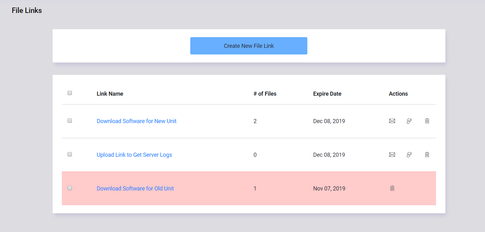
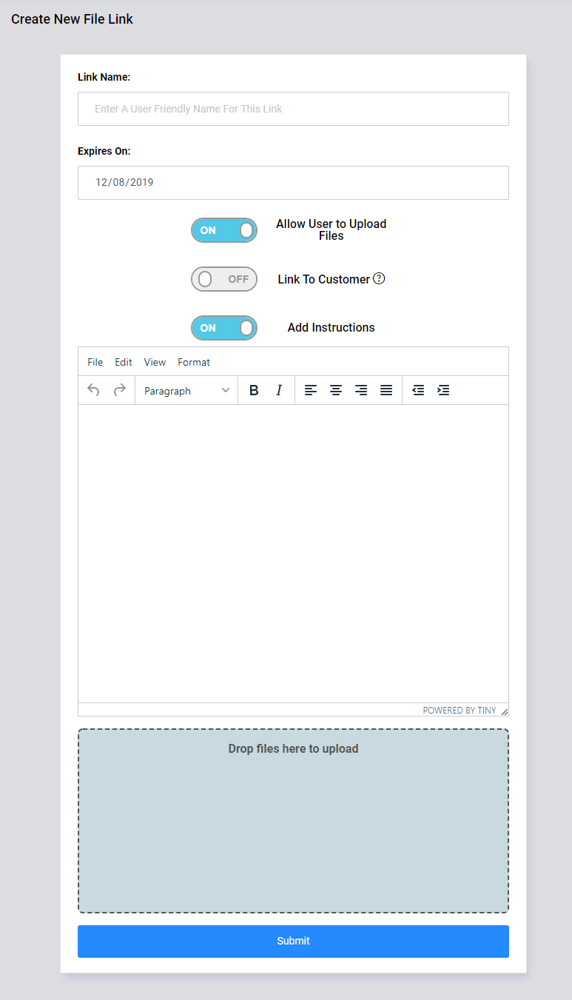

File Links
==========

The File Links section allows you to send or receive files to non Tech Bench users.  An example would be if a customer needed access to a
file that is too large to email, or has a file extension that is commonly blocked by email Spam Filters (.exe for example).
Files can be uploaded by you for the customer, or you can allow the customer to upload files for you to access.

Each file link has a custom URL and expiration date.  When the file link expires, you will be the only one that will still have access to the files.

Primary File Links Page
-----------------------

The primary page gives basic information about each of the file links you have created, such as the name you assigned to the link, the
date it will expire, and how many total files are attached to the link.

The following options are available in the Primary File Links Page

===========     =======
Column          Details
===========     =======
Link Name       The assigned name of the file link.  By clicking on the name, you can access the details of the link itself.
# of Files      The number of files that are attached to the link.  This is the number of files uploaded both by the owner of the link, and any guests that have accessed the link.
Expire Date     Shows the date that the link will no longer be accessable by a guest.  Note:  if the link is highlighted in red, it has already expired.
Actions         Options that can be applied to the selected link.
===========     =======

The Actions column has the following options:

=======   =======
Action    Details
=======   =======
Email     Will open your default email client with basic information about the file link already filled in.*
Disable   Will set the expiration date to yesterday, so the link is immediately no longer accessable.*
Delete    Will delete the file link and any files that are attached to it.
Note:*    These options are only available for links that have not yet expired.
=======   =======

Create File Link Page
---------------------

To create a new file link, you will need the following information:

==========================  ===========
Field                       Description
==========================  ===========
Link Name                   Enter a name to identify the link.  This name is not public and will not be seen by the guest
Expires On                  Select the date that the link will expire.  The default is 30 days from the current date.
Allow User to Upload Files  If selected, the guest can upload files.  If unchecked, the guest will not have the option to upload files.
Link to Customer            If a customer is selected, files loaded by a guest can be moved to that customers profile.
Add Instructions            With this option selected, an additional field will open up to allow you to place a custom message that will be displayed when visiting the link.
File Upload                 Files can be added to the link right away, or later via the details page.  Up to five files can be loaded at a time.
Create Link                 This will upload attached files (if available) and create the link.  Once the link is created, you will be redirected to the Link Details page.
==========================  ===========

Link Details Page
-----------------

.. image:: img/file_link_details_1.PNG
    :alt: Link Details Image
.. image:: img/file_link_details_2.PNG
    :alt: Link Details Image

The Link Details page will show all information about the currently selected link.

+-----------------------+-------------------+---------------------------------------------------------------------------------------------------------------+
| Section               | Field             | Description                                                                                                   |
+=======================+===================+===============================================================================================================+
| Link Details          | Link Name         | The name assigned to the link. Note:  This will not show up on this link, it is for internal reference only.  |
|                       +-------------------+---------------------------------------------------------------------------------------------------------------+
|                       | Customer          | Name of attached customer (if assigned).                                                                      |
|                       +-------------------+---------------------------------------------------------------------------------------------------------------+
|                       | Expire Date       | The date the link will no longer be accessable by a guest.                                                    |
|                       +-------------------+---------------------------------------------------------------------------------------------------------------+
|                       | Allow Uploads     | Notes if the guest is allowed to upload files.                                                                |
|                       +-------------------+---------------------------------------------------------------------------------------------------------------+
|                       | Link              | The URL the guest will use to access the link.                                                                |
+-----------------------+-------------------+---------------------------------------------------------------------------------------------------------------+
| Actions               | Edit Link         | Modify the link details or the link instructions                                                              |
|                       +-------------------+---------------------------------------------------------------------------------------------------------------+
|                       | Email Link        | Will open your default email client with basic information about the file link already filled in.             |
|                       +-------------------+---------------------------------------------------------------------------------------------------------------+
|                       | Delete Link       | Will delete the link and all attached files.                                                                  |
+-----------------------+-------------------+---------------------------------------------------------------------------------------------------------------+
| Instructions          |                   | Instructions will be shown to the guest when they visit the link.  These can be edited by clicking "Edit Link"|
+-----------------------+-------------------+---------------------------------------------------------------------------------------------------------------+
| Link Files            | File Name         | Clicking on the name of the file will download it to your device.                                             |
|                       |                   | The "Info" icon will show who uploaded the file and any notes they included with the file.                    |
|                       +-------------------+---------------------------------------------------------------------------------------------------------------+
|                       | Date Added        | Date the file was loaded to the file link.                                                                    |
|                       +-------------------+---------------------------------------------------------------------------------------------------------------+
|                       | Added By          | If the file was added by a guest, their name will show in this field.                                         |
|                       +-------------------+---------------------------------------------------------------------------------------------------------------+
|                       | File Notes        | If the file was added by a guest, any notes they provided with the file will show in this field.              |
|                       +-------------------+---------------------------------------------------------------------------------------------------------------+
|                       | Actions           | - Move File - will move file to customer profile (only available if customer assigned)                        |
|                       |                   | - Delete File - will delete just this file from the file link                                                 |
+-----------------------+-------------------+---------------------------------------------------------------------------------------------------------------+
