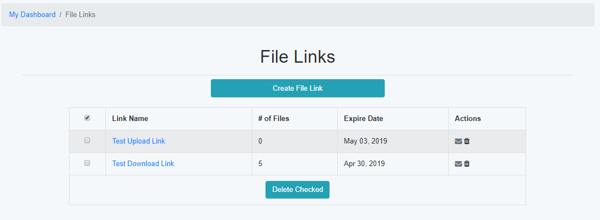
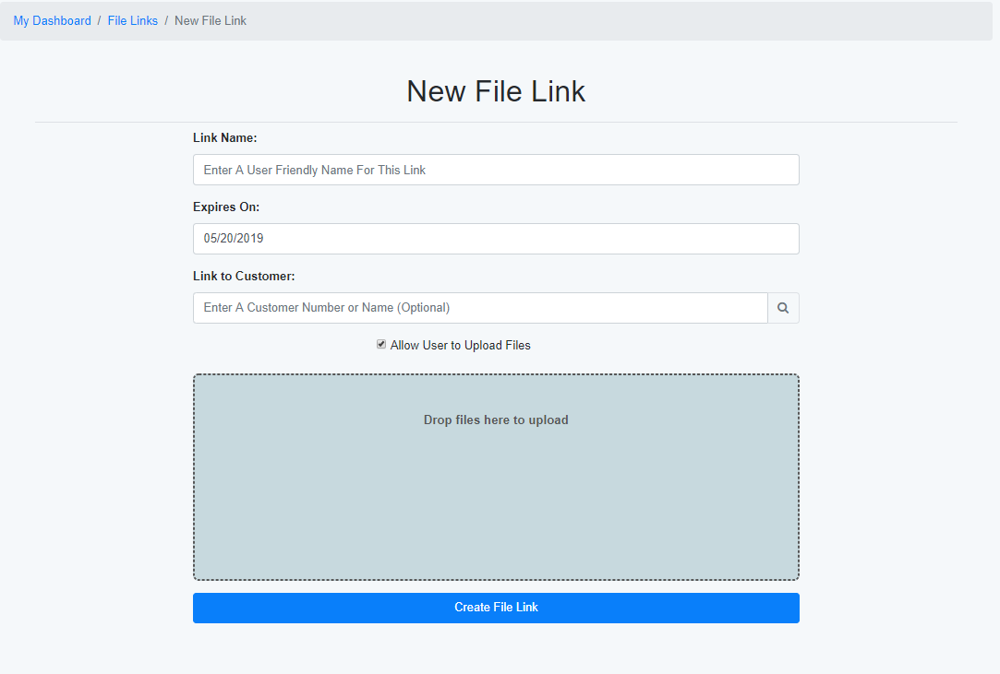
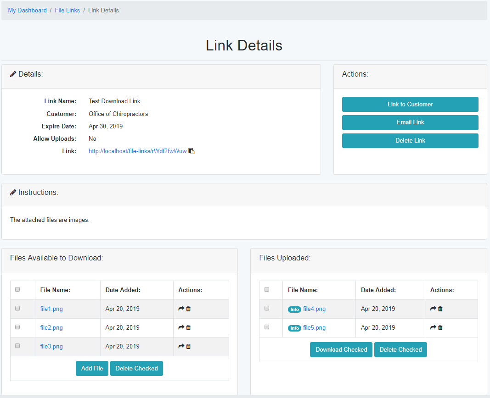

File Links
==========

The File Links section allows you to pass files to non Tech Bench users.  An example would be if a customer needs access to a file that is too large to email, or has a file extension (example - .exe) that is commonly blocked by email Spam Filters.  Files can be uploaded by you for the customer, or allow the customer to upload files for you to access.

Each file link has a custom URL and expiration date.  When the file link expires, the files within it can no longer be accessed by a non registered user.

Primary File Links Page
-----------------------

    
The primary page gives basic information by showing how many file links you have created, and how many files are attached to the link.  

The following options are available in the Primary File Links Page

===========     =======
Column          Details
===========     =======
Link Name       The assigned name of the file link.  By clicking on the name, you can access the details of the link itself.
of Files        The number of files that are attached to the link.  This is the number of files uploaded both by the owner of the link, and any guests that have accessed the link.
Expire Date     Shows the date that the link will no longer be accessable by a guest.
Actions         Options that can be applied to the selected link.
===========     =======

The Actions column has the following options:

======  =======
Action  Details
======  =======
Email   Will open your default email client with basic information about the file link already filled in.
Delete  Will delete the file link and any files that are attached to it.
======  =======

Create File Link Page
---------------------

    
To create a new file link, you will need the following information:

==========================  ===========
Field                       Description
==========================  ===========
Link Name                   Enter a name to identify the link.  This name is not public and will not be seen by the guest
Expires On                  Select the date that the link will expire.  The default is 30 days from the current date.
Link to Customer            If a customer is selected, files loaded by a guest can be moved to that customers profile.
Allow User to Upload Files  If selected, the guest can upload files.  If unchecked, the guest will not have the option to upload files.
File Upload                 Files can be added to the link right away, or later via the details page.  Up to five files can be loaded at a time.
Create Link                 This will upload attached files (if available) and create the link.  Once the link is created, you will be redirected to the Link Details page.
==========================  ===========

Link Details Page
-----------------

The Link Details page will show all information about the currently selected link. 

+-----------------------+-------------------+-------------------------------------------------------------------------------------------------------+
| Section               | Field             | Description                                                                                           |
+=======================+===================+=======================================================================================================+
| Details               | Link Name         | The name assigned to the link.                                                                        |
|                       +-------------------+-------------------------------------------------------------------------------------------------------+
| You can edit the      | Customer          | Name of attached customer (if assigned).                                                              |
| details by clicking   +-------------------+-------------------------------------------------------------------------------------------------------+
| the pencil icon       | Expire Date       | The date the link will no longer be accessable by a guest.                                            |
|                       +-------------------+-------------------------------------------------------------------------------------------------------+
|                       | Allow Uploads     | Notes if the guest is allowed to upload files.                                                        |
|                       +-------------------+-------------------------------------------------------------------------------------------------------+
|                       | Link              | The URL the guest will use to access the link.                                                        |
|                       |                   | Click the "copy" icon next to the link to copy it to the clipboard.                                   |
+-----------------------+-------------------+-------------------------------------------------------------------------------------------------------+
| Actions               | Link to Customer  | Set or update the customer that the link is attached to.                                              |
|                       | Email Link        | Will open your default email client with basic information about the file link already filled in.     |
|                       | Delete Link       | Will delete the link and all attached files.                                                          |
+-----------------------+-------------------+-------------------------------------------------------------------------------------------------------+
| Instructions                              | Instructions will be shown to the guest when they visit the link.                                     |
+-----------------------+-------------------+-------------------------------------------------------------------------------------------------------+
| Files Available       | File Name         | Clicking on the name of the file will download it to your device.                                     |
| to Download           |                   | The "Info" icon will show who uploaded the file and any notes they included with the file.            |
| and                   +-------------------+-------------------------------------------------------------------------------------------------------+                  
| Files Uploaded        | Date Added        | Date the file was loaded to the file link.                                                            |
|                       +-------------------+-------------------------------------------------------------------------------------------------------+
|                       | Actions           | | Move File Icon - will move file to customer profile (only available if customer assigned)           |
|                       |                   | | Delete File Icon - will delete just this file from the file link                                    |
+-----------------------+-------------------+-------------------------------------------------------------------------------------------------------+
