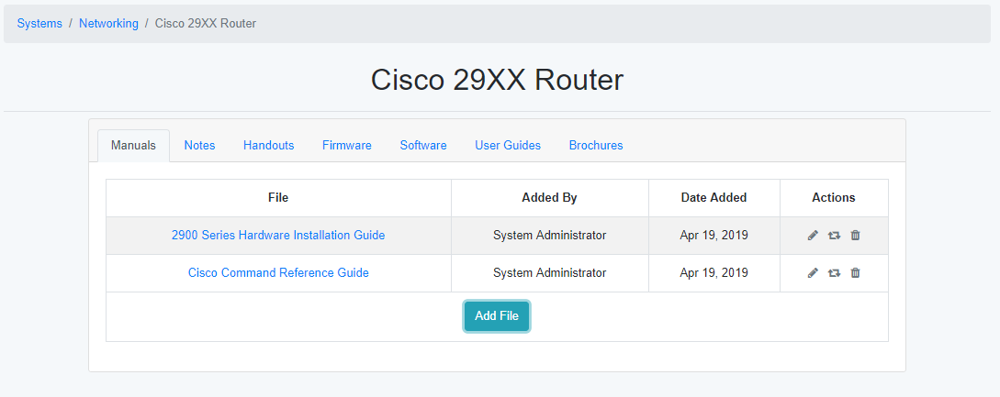

System Information
==================

The system information page is used to store documentation and other files for the selected system.

System Details Page
-------------------

    
The System Details page shows all of the files for the system and information about that file.  Clicking on the file will download it, while hovering over the file will display a description of the file (if available).  The Actions tab allows for modifications of the file and its attributes.

=======  =======
Action   Details
=======  =======
Edit     Allows you to edit the name or the description of the file.
Replace  Allows the file to be replaced with a newer version of the file.  The name and description are not changed.
Delete   The file is removed from the system details page.
=======  =======
